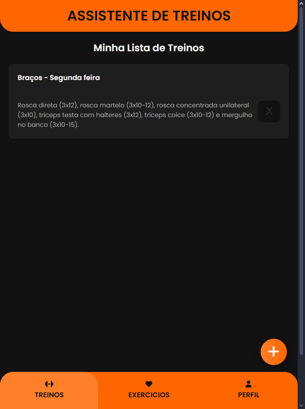

# 💪 Assistente de Treinos

**Aplicação web simples para criar, listar e gerenciar treinos personalizados.**  
Ideal para quem quer registrar a rotina de treinos de forma rápida, direto do navegador.

---

## ✨ Funcionalidades

- ✅ Adição de treinos com nome e descrição (ex: foco em hipertrofia, força etc.)
- 🗂️ Exibição dos treinos em cards
- ❌ Remoção de treinos com botão em cada card
- 💾 Armazenamento local com `localStorage`, mantendo dados salvos no navegador
- 🧭 Barra de navegação inferior com destaque para página ativa (index)
- 📱 Layout responsivo com modal de criação de treino

---

## 🛠️ Tecnologias e Ferramentas Utilizadas

- HTML5 + CSS3

- JavaScript (ES6+)

- Font Awesome (ícones)

---

## 📸 Preview

---

## 📌 Possíveis Melhorias Futuras

- Adição de exercícios personalizados dentro de cada treino

- Funcionalidade de edição de treinos existentes

- Navegação funcional entre abas da navbar (Exercícios, Perfil)

- Autenticação e sincronização com backend

- Responsividade total para dispositivos menores
